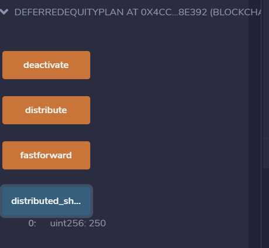

# Smart Contract - Company Shares

In this contract, I will be managing an employee's "deferred equity incentive plan" in which 1000 shares will be distributed over 4 years to the employee. I won't need to work with Ether in this contract, but I will be storing and setting amounts that represent the number of distributed shares the employee owns and enforcing the vetting periods automatically.

* **A two-minute primer on deferred equity incentive plans:** In this set-up, employees receive shares for joining and staying with the firm. They may receive, for example, an award of 1,000 shares when joining, but with a 4 year vesting period for these shares. This means that these shares would stay with the company, with only 250 shares (1,000/4) actually distributed to and owned by the employee each year. If the employee leaves within the first 4 years, he or she would forfeit ownership of any remaining (“unvested”) shares.

Here we can see an example of 250 shares that we distributed.

